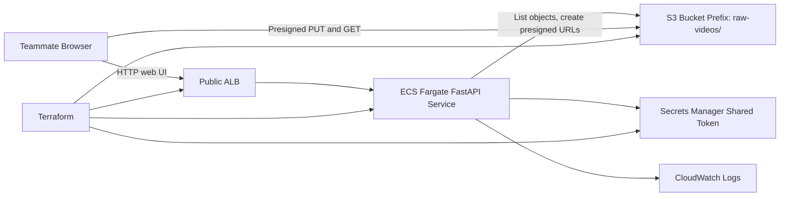

# Video Upload Portal

Hackathon-friendly FastAPI portal for sharing raw videos in S3. Terraform provisions a public ECS Fargate service behind an ALB, a private S3 bucket with a `raw-videos/` prefix, ECR, IAM, logs, and a generated shared token in Secrets Manager.



## Deploy

Source the temporary workshop credentials first:

```bash
set -a
source ./.aws-demo.env
set +a
unset AWS_PROFILE
export AWS_CONFIG_FILE=/dev/null
```

Create the AWS resources:

```bash
cd infra
terraform init
terraform apply
```

Push the app image:

```bash
ACCOUNT_ID="$(aws sts get-caller-identity --query Account --output text)"
REGION="us-east-1"
REPO_URL="$(terraform output -raw ecr_repository_url)"

aws ecr get-login-password --region "$REGION" \
  | docker login --username AWS --password-stdin "${ACCOUNT_ID}.dkr.ecr.${REGION}.amazonaws.com"

docker build -f ../app/Dockerfile -t "${REPO_URL}:latest" ..
docker push "${REPO_URL}:latest"
```

Scale the service up so ECS pulls the pushed image:

```bash
terraform apply -var desired_count=1
```

Get the URL and shared token:

```bash
terraform output -raw alb_url
terraform output -raw shared_token_lookup_command | bash
```

## Local App Smoke Test

```bash
pipenv install
S3_BUCKET="example-bucket" S3_PREFIX="raw-videos/" UPLOAD_PORTAL_TOKEN="dev-token" \
  pipenv run uvicorn app.main:app --reload
```
