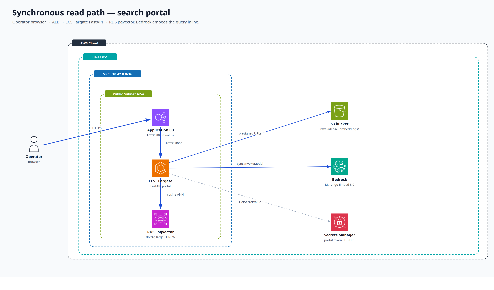
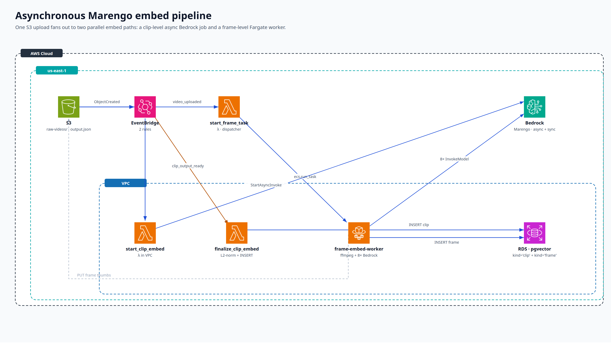
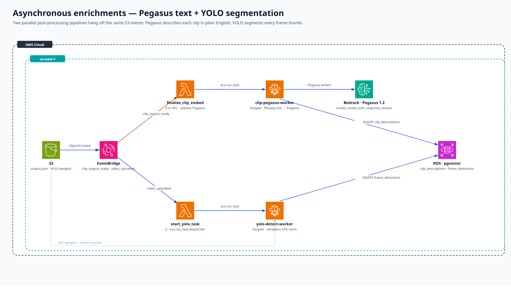
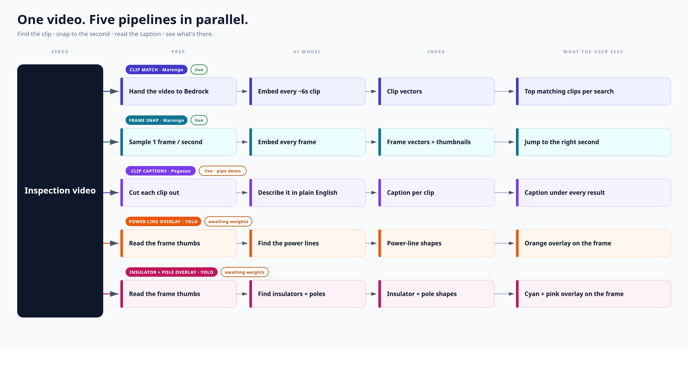

# Energy Hackathon — Multimodal Video Search

Search drone footage by **text**, by **image**, or by **text + image** and
get back the exact moment that matches — frame-precise playback, plain-
English clip descriptions from Pegasus, and YOLO instance-segmentation
polygons painted over the matched frame.

Built on **TwelveLabs Marengo Embed 3.0** + **Pegasus 1.2** (both via
**Amazon Bedrock**), **Postgres + pgvector** (HNSW cosine ANN),
**Ultralytics YOLO** for instance segmentation, and a FastAPI portal on
**ECS Fargate**. The async ingest pipeline is four Lambdas + three
Fargate workers wired up with EventBridge.

```
your.mp4 ─▶ S3 ─▶ EventBridge ─┬─▶ clip embedding (Marengo, async)
                               ├─▶ frame embedding (Marengo, sync x8)
                               ├─▶ clip description (Pegasus, streaming)
                               └─▶ frame segmentation (YOLO, ultralytics)

text/image query ─▶ Bedrock embed ─▶ pgvector HNSW ─▶ frame-snap + dedupe
                                  ─▶ join Pegasus text + YOLO polygons
                                  ─▶ presigned video #t=<sec> + thumb
```

---

## Architecture

Three slides' worth of architecture, exported as both standalone SVG and
2x PNG. Each diagram is fully self-contained (AWS icons embedded as data
URIs) so they drop straight into a deck or doc.

### 1. Synchronous read path — search portal

The whole "user types a query and gets answers" loop. Browser hits the
ALB, the Fargate FastAPI portal embeds the query against Bedrock,
queries pgvector, and renders results. No EventBridge, no async.



Source: [`docs/architecture/architecture_sync.svg`](docs/architecture/architecture_sync.svg)

### 2. Asynchronous Marengo embed pipeline

One S3 upload fans out to two parallel embed paths off the same
EventBridge `video_uploaded` rule: a clip-level async Bedrock job
(`StartAsyncInvoke`) and a frame-level Fargate worker that runs 8
parallel sync `InvokeModel` calls.



Source: [`docs/architecture/architecture_marengo.svg`](docs/architecture/architecture_marengo.svg)

### 3. Asynchronous enrichments — Pegasus text + YOLO segmentation

Two more Fargate workers hang off the same bus: `clip-pegasus-worker`
fires when Marengo's clip rows land (`clip_output_ready`), cuts each
clip with ffmpeg, and streams a Pegasus description into
`clip_descriptions`; `yolo-detect-worker` runs in parallel with the
frame worker, downloads weights from S3, and writes per-frame
polygons into `frame_detections`.



Source: [`docs/architecture/architecture_enrichments.svg`](docs/architecture/architecture_enrichments.svg)

### Five parallel pipelines, one search hit

Functional view (no AWS noise) of how a single inspection video fans out
into the five things that come back when you search.



Source: [`docs/architecture/parallel_pipelines.svg`](docs/architecture/parallel_pipelines.svg)

### Bonus diagrams

- [`docs/architecture/design_space.svg`](docs/architecture/design_space.svg)
  — every plausible path a video can take through the system, with the
  five shipped pipelines as bold lanes.
- [`docs/architecture/aws_resources.svg`](docs/architecture/aws_resources.svg)
  — the full Terraform resource catalogue (every Lambda, role, log
  group, SG rule).
- [`docs/energy-hackathon-deck.pptx`](docs/energy-hackathon-deck.pptx)
  — the slide deck (architecture + algorithm walkthrough + numbers +
  roadmap).

Mermaid version of the same architecture lives in
[`docs/architecture.md`](docs/architecture.md).

---

## What it does

| Capability | Where it lives | Status |
| --- | --- | --- |
| **Text search** ("two people in a car near a transformer") | sync `InvokeModel` → pgvector HNSW | live |
| **Image search** (drag-and-drop a frame) | sync `InvokeModel` (image) → pgvector HNSW | live |
| **Text + image search** (combined query) | sync `InvokeModel` (text-image) → pgvector HNSW | live |
| **Frame-precise playback** | frame embeddings + frame-snap refinement | live |
| **Per-clip natural-language description** (Pegasus 1.2) | `clip-pegasus-worker` Fargate task | live |
| **Per-frame instance segmentation** (Ultralytics YOLO) | `yolo-detect-worker` Fargate task | live |
| **Class-filtered toggles in the UI** (master + per-class polygon overlay) | `app/static/app.js` + `/api/detection-classes` | live |

---

## Repo layout

```
app/                      # FastAPI portal (search + upload UI, ECS Fargate)
  main.py                 # FastAPI routes (sync read path)
  search.py               # cosine ANN + frame-snap + dedupe + Pegasus/YOLO joins
  db.py                   # psycopg AsyncConnectionPool + helpers
  static/, templates/     # JS, CSS, Jinja2

infra/                    # Terraform — everything below is one apply
  main.tf                 # VPC, ALB, ECS, S3, Secrets, IAM, ECR
  rds.tf                  # RDS Postgres 16 + pgvector parameter group
  embedding.tf            # 4 lambdas, 3 fargate workers, EventBridge, VPC endpoints
  embedding.variables.tf  # YOLO_MODELS roster, sizing knobs, etc.

lambda/                   # Async pipeline dispatchers (Python 3.12, pg8000)
  start_clip_embed/       # video_uploaded   → bedrock.start_async_invoke
  finalize_clip_embed/    # clip_output_ready → INSERT clip + spawn Pegasus
  start_frame_task/       # video_uploaded   → ecs.run_task frame-embed-worker
  start_yolo_task/        # video_uploaded   → ecs.run_task yolo-detect-worker

worker/                   # Fargate worker images (psycopg, boto3)
  frame_embed/            # ffmpeg + 8x parallel sync Marengo InvokeModel
  clip_pegasus/           # ffmpeg cut + Pegasus invoke_model_with_response_stream
  yolo_detect/            # ultralytics CPU torch + cv2 polygon export

scripts/
  build_lambdas.sh        # build the four lambda zips into .build/
  upload_yolo_models.sh   # push pld-yolo best.pt files into s3://.../models/yolo/
  embed/                  # local-laptop CLI: bulk-embed, search, mini web UI
  pegasus/, yolo/         # local helpers for prompt iteration / model debugging

pld-yolo/                 # YOLO-seg training project (folded in from the
                          # sister pld-yolo repo). Code + labeled airpelago
                          # frames are tracked; runs/ and *.pt weights are
                          # gitignored — produce them locally and push to
                          # S3 with scripts/upload_yolo_models.sh.

docs/                     # slide deck + architecture diagrams + roadmap
  architecture/           # standalone SVG + 2x PNG renderings
  build_slides.py         # python-pptx builder for energy-hackathon-deck.pptx
  build_architecture_svgs.py   # builds the three AWS architecture SVGs
  build_pipelines_svg.py       # builds parallel_pipelines.svg
  build_design_space_svg.py    # builds design_space.svg
  build_aws_resources_svg.py   # builds aws_resources.svg
  render_svgs.py          # bulk SVG -> 2x PNG via headless Chrome
  icons/aws/              # official AWS service icons used by the SVGs
```

---

## Quickstart

### 0. Prereqs

- AWS workshop credentials in `./.aws-demo.env` (sets
  `AWS_ACCESS_KEY_ID` / `AWS_SECRET_ACCESS_KEY` / `AWS_SESSION_TOKEN`).
- `terraform` ≥ 1.6, `aws` v2, `docker` (with `buildx`), `pipenv`,
  `python` 3.12, `ffmpeg` (only needed for local embed iteration).
- Bedrock model access enabled in `us-east-1` for both
  `twelvelabs.marengo-embed-3-0-v1:0` and `twelvelabs.pegasus-1-2-v1:0`.

```bash
set -a; source ./.aws-demo.env; set +a
unset AWS_PROFILE
export AWS_CONFIG_FILE=/dev/null
```

### 1. Provision

```bash
cd infra
terraform init
terraform apply
```

This stands up the VPC, two public subnets, the ALB, the ECS cluster
and Fargate service for the portal, the RDS pgvector instance, the
S3 bucket with EventBridge notifications, the four Lambdas, the three
Fargate **task definitions** (no running workers — they spawn on
demand), the four ECR repos, and all the IAM glue.

### 2. Build + push images

```bash
# 2a. Lambda zips (regenerated into .build/lambda/<handler>/, picked up
#     by terraform's archive_file blocks).
scripts/build_lambdas.sh

# 2b. Portal app image.
ACCOUNT=$(aws sts get-caller-identity --query Account --output text)
REGION=$(aws configure get region || echo us-east-1)
PORTAL_REPO=$(terraform -chdir=infra output -raw ecr_repository_url)
aws ecr get-login-password --region "$REGION" | \
    docker login --username AWS --password-stdin "$ACCOUNT.dkr.ecr.$REGION.amazonaws.com"
docker buildx build --platform linux/amd64 -f app/Dockerfile -t "$PORTAL_REPO:latest" --push .

# 2c. Three worker images. Repos are named "<project_name>-<role>-worker"
#     where project_name defaults to "video-upload-portal" (infra/variables.tf).
PROJECT="video-upload-portal"
for pair in "frame_embed:frame-worker" "clip_pegasus:clip-pegasus-worker" "yolo_detect:yolo-detect-worker"; do
    DIR="${pair%%:*}"; SLUG="${pair##*:}"
    REPO=$(aws ecr describe-repositories \
              --repository-names "${PROJECT}-${SLUG}" \
              --query 'repositories[0].repositoryUri' --output text)
    docker buildx build --platform linux/amd64 \
        -f "worker/${DIR}/Dockerfile" -t "$REPO:latest" --push .
done

# 2d. Roll the portal forward so it picks up the latest image and runs
#     pending pgvector migrations. ECS cluster and service are both
#     named after project_name.
terraform -chdir=infra apply
aws ecs update-service --cluster "$PROJECT" --service "$PROJECT" \
    --force-new-deployment
```

### 3. Upload YOLO weights

The YOLO worker reads checkpoints from
`s3://<bucket>/models/yolo/<name>/v1/best.pt`. Train (or drop in)
weights under `pld-yolo/runs/<run>/weights/` first; the upload helper
picks `best.pt` and falls back to `last.pt`.

```bash
# Defaults to ./pld-yolo/runs/...; override with PLD_YOLO_DIR=...
# to point at an out-of-tree checkout.
S3_BUCKET="$(terraform -chdir=infra output -raw bucket_name)" \
    bash scripts/upload_yolo_models.sh
```

See [`pld-yolo/README.md`](pld-yolo/README.md) for the training
workflow (download, label, train, eval, video demo).

### 4. Use it

```bash
terraform -chdir=infra output -raw alb_url
terraform -chdir=infra output -raw shared_token_lookup_command | bash
```

Open the URL in a browser, paste the shared token when prompted, drop
a video into the **Raw Videos** tab, and the async pipeline takes it
from there. Once you see the row count tick up under the search bar,
search is live. Drop a frame thumbnail into the IMAGE tab to do
visual search.

---

## Local development

### Run the portal locally against a deployed bucket

The DB URL lives in Secrets Manager — pull it via the helper output:

```bash
pipenv install

DB_SECRET_ARN=$(terraform -chdir=infra output -raw database_secret_arn)
export DATABASE_URL=$(aws secretsmanager get-secret-value \
    --secret-id "$DB_SECRET_ARN" --query SecretString --output text \
    | python -c 'import json,sys; print(json.load(sys.stdin)["url"])')

S3_BUCKET="$(terraform -chdir=infra output -raw bucket_name)" \
S3_PREFIX="raw-videos/" \
UPLOAD_PORTAL_TOKEN="dev-token" \
RUN_MIGRATIONS=0 \
MARENGO_INFERENCE_ID=us.twelvelabs.marengo-embed-3-0-v1:0 \
    pipenv run uvicorn app.main:app --reload
```

Note: this connects to RDS through the bastion-less default; if you're
not on a peered network, hop through the portal task or a temporary
EC2 with the right SG.

### Local Marengo iteration (no Postgres, no Lambda)

The `scripts/embed/` CLI bulk-embeds whatever's in the bucket onto your
laptop disk, then runs an in-memory cosine search. Perfect for
prompt-engineering and ranking experiments.

```bash
export S3_BUCKET="$(terraform -chdir=infra output -raw bucket_name)"
pipenv run python -m scripts.embed.embed_videos             # clip embeddings
pipenv run python -m scripts.embed.embed_frames             # frame embeddings
pipenv run python -m scripts.embed.search text "vegetation near a transmission line" -k 5
pipenv run python -m scripts.embed.serve                    # local web UI on :8001
```

See [`scripts/embed/README.md`](scripts/embed/README.md) for full
walkthrough.

### Pegasus / YOLO experimentation

```bash
# Pegasus — describe a clip end-to-end via Bedrock streaming
pipenv run python -m scripts.pegasus.cli --help

# YOLO — run a local checkpoint over a frame folder (CPU torch)
pipenv run python -m scripts.yolo.run_local --help
```

These mirror exactly what the Fargate workers do in production, just
without the Postgres/S3 hops, so iteration on prompts or model versions
is fast.

---

## How search works

Roughly:

1. **Embed the query.** Sync `bedrock.invoke_model` against the `us.`
   Marengo cross-region inference profile. Returns a 512-d float32 vector,
   L2-normalized so cosine and dot agree.
2. **Pull a candidate pool from Postgres.** One HNSW cosine ANN against
   `embeddings` — both `kind='clip'` and `kind='frame'` rows live in
   the same index. We pull `LIMIT 200` so there's room to refine.
3. **Frame-snap.** For every clip hit, pick the highest-scoring frame
   whose `timestamp_sec` falls inside `[start_sec, end_sec]`. The clip
   stays as the "result", but its preview seeks to that frame.
4. **Dedupe.** Walk the refined hits in score order; drop anything
   within ~3 s of an already-kept hit on the same `s3_key`. Stops the
   "10 results from one moment" failure mode.
5. **Enrich.** Bulk-fetch `clip_descriptions` (Pegasus) for the surviving
   `(s3_key, start_sec, end_sec)` triples and `frame_detections` (YOLO)
   for the `(s3_key, frame_index)` pairs. Both joins fail open if the
   table doesn't exist yet (fresh cluster).
6. **Return.** Each result has a presigned `video_url` (with
   `#t=<frame_timestamp>`), a presigned `thumb_url`, the Pegasus
   `clip_description`, and the YOLO `detections` (normalized polygons
   the UI paints with one `<svg viewBox="0 0 1 1">`).

The full SQL + numpy in [`app/search.py`](app/search.py); the matching
in-memory implementation that powers the local CLI is in
[`scripts/embed/_lib.py`](scripts/embed/_lib.py). The slide deck has
diagrams of all five steps — see "frame-snap" and "search algorithm" in
[`docs/energy-hackathon-deck.pptx`](docs/energy-hackathon-deck.pptx).

---

## Data model

```
videos
  s3_key (pk)            text
  bucket                 text
  invocation_arn         text
  output_prefix          text                        -- 0002 migration
  status                 pending | clips_ready | frames_ready | ready
  …

embeddings (HNSW cosine on `embedding`, m=16, ef_construction=64)
  s3_key                 text   -> videos.s3_key
  kind                   'clip' | 'frame'
  embedding_option       visual | audio | transcription | frame
  segment_index          int                         -- non-null for clip
  frame_index            int                         -- non-null for frame
  start_sec, end_sec, timestamp_sec
  thumb_s3_key           text                        -- non-null for frame
  embedding              vector(512)

clip_descriptions                                    -- 0003 migration
  (s3_key, start_sec, end_sec, prompt_id) unique
  clip_s3_key, prompt, message, model_id

frame_detections                                     -- 0004 migration
  (s3_key, frame_index) -> embeddings
  model_name, model_version, class_id, class_name
  confidence, bbox_xyxy[4], polygon_xy[]             -- normalized to [0, 1]
```

See [`scripts/embed/migrations/`](scripts/embed/migrations/) for the
full DDL — these run automatically when the portal starts with
`RUN_MIGRATIONS=1`.

---

## Operational notes (the gotchas that bit us)

- **`*.dist-info` matters in Lambda zips.** `pg8000` ⇒ `scramp` ⇒
  `importlib.metadata.version("scramp")` at import time — strip the
  dist-info dirs and the Lambda crashes with `PackageNotFoundError`
  before your handler runs. `scripts/build_lambdas.sh` only strips
  `__pycache__/` and `*.egg-info/` for this reason.
- **VPC Lambdas need VPC endpoints, not NAT.** The two VPC Lambdas
  (`start_clip_embed`, `finalize_clip_embed`) sit in our public subnets
  but get no public IPs. We added Gateway endpoints for S3 and
  Interface endpoints for Bedrock + Secrets Manager
  (`infra/embedding.tf`) — much cheaper than a NAT gateway.
- **EventBridge `wildcard` vs `suffix`.** Bedrock async writes
  `embeddings/videos/<job-uuid>/<bedrock-id>/output.json` — the inserted
  Bedrock job-id segment means a `suffix=output.json` filter never
  matches. We use `wildcard = "embeddings/videos/*/output.json"`
  instead.
- **Two-Lambda split for the clip path.** `start_clip_embed` is fast
  and synchronous (kicks off the async Bedrock job, writes the parent
  row); `finalize_clip_embed` runs minutes later off `clip_output_ready`.
  Keeps each invocation under the 15-minute Lambda budget regardless of
  Bedrock queue depth.
- **YOLO worker self-gates on frame rows.** The frame worker and YOLO
  worker fire off the same `video_uploaded` event in parallel. The
  YOLO worker polls `embeddings WHERE kind='frame'` until rows exist
  before downloading weights or doing inference, so re-uploading a
  video doesn't race the frame pipeline.
- **Migrations are baked into the portal image.** `app/Dockerfile`
  copies `scripts/embed/migrations/*.sql` into the image; on boot the
  portal applies any unrun migrations and records them in `_migrations`,
  so re-deploys are no-ops.

---

## Phases shipped

| Phase | Description |
| --- | --- |
| A | Local-laptop Marengo CLI + in-memory search |
| D.1 | Postgres + pgvector, migrations on portal boot |
| D.2 | `/api/search/{text,image,text-image}` against pgvector |
| D.3 | Async clip embed pipeline (2 Lambdas + EventBridge) |
| D.4 | Frame-embed Fargate worker, frame-snap UI |
| D.5 | Pegasus per-clip text descriptions + UI panel |
| D.6 | YOLO instance segmentation + per-class toggle UI |

Detail on every phase, including the resources Terraform owns at each
boundary and the IAM statements that ship with each, lives in
[`docs/embedding-roadmap.md`](docs/embedding-roadmap.md).

---

## Regenerating the deck and diagrams

```bash
# Slide deck (python-pptx)
pip install python-pptx matplotlib
python3 docs/build_slides.py

# Standalone SVG diagrams + 2x PNGs
python3 docs/build_architecture_svgs.py     # the three AWS slides
python3 docs/build_pipelines_svg.py         # the marketing pipelines view
python3 docs/build_design_space_svg.py      # the design-space flowchart
python3 docs/build_aws_resources_svg.py     # the resource catalogue
python3 docs/render_svgs.py                 # SVG -> PNG via headless Chrome
```

The PowerPoint deps (`python-pptx`, `matplotlib`) are deliberately not
in the Pipfile so the deployed FastAPI image stays lean.
