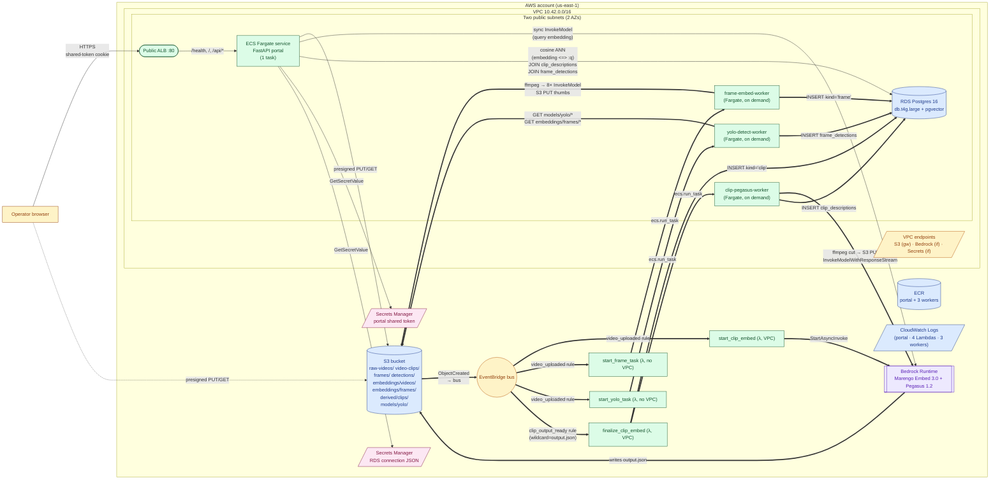

# Architecture (current Terraform)

This is a snapshot of what `infra/*.tf` actually deploys today. Both the
synchronous read path (FastAPI portal on ECS) **and** the async
embedding + Pegasus + YOLO pipeline (EventBridge → 4 Lambdas + 3
Fargate workers) are now in Terraform; the slide deck
(`docs/energy-hackathon-deck.pptx`) draws each on its own slide. The
fourth Lambda + third worker (`start_yolo_task` + `yolo-detect-worker`)
ship their code under D.6 but only fire once the trained `.pt` files
are uploaded to `s3://.../models/yolo/<name>/v1/best.pt`.

## Resources Terraform owns today

### Synchronous read path — `infra/main.tf`, `infra/rds.tf`

| Layer | Resources |
| --- | --- |
| Network | `aws_vpc`, `aws_internet_gateway`, two `aws_subnet.public` (2 AZs), `aws_route_table` + association, `aws_security_group.alb`, `aws_security_group.app` |
| Edge | `aws_lb` (public ALB), `aws_lb_target_group`, `aws_lb_listener` (port 80) |
| Compute | `aws_ecs_cluster`, `aws_ecs_task_definition` (Fargate, 512 CPU / 1024 MiB), `aws_ecs_service` (1 task, public IP, ALB target) |
| Image registry | `aws_ecr_repository.app` |
| Logs | `aws_cloudwatch_log_group` (`/ecs/<project>`, 7-day retention) |
| Storage | `aws_s3_bucket.videos` (private, AES256, BucketOwnerEnforced, CORS) plus prefix markers: `raw-videos/`, `video-clips/`, `frames/`, `detections/`, `embeddings/videos/`, `embeddings/frames/`, `derived/clips/`, `models/yolo/` |
| Secrets | `aws_secretsmanager_secret.portal_token`, `aws_secretsmanager_secret.db` (with JSON `url` key) |
| Database | `aws_db_instance.postgres` (Postgres 16, `db.t4g.large`, gp3 20-50 GiB autoscale, single-AZ), tuned `aws_db_parameter_group` for pgvector / HNSW, `aws_db_subnet_group`, `aws_security_group.db` |
| IAM | `task_execution` role (ECR pull + Logs + read both secrets), `task` role (S3 list/CRUD on portal prefixes + `bedrock:InvokeModel` on `twelvelabs.marengo-embed-3-0-v1:0` and the `us.` cross-region inference profile) |

The ECS task receives `AWS_REGION`, `S3_BUCKET`, `PORTAL_CATEGORIES`, and
`RUN_MIGRATIONS=1` as plain env vars, plus `UPLOAD_PORTAL_TOKEN` and
`DATABASE_URL` (a libpq URL extracted from the `url` JSON key of the DB
secret) as ECS secrets resolved by the execution role.

### Async write path — `infra/embedding.tf`

| Layer | Resources |
| --- | --- |
| Eventing | `aws_s3_bucket_notification.videos_eventbridge` (bucket-level → EventBridge), `aws_cloudwatch_event_rule.video_uploaded` (prefix `raw-videos/`, three Lambda targets: clip / frame / yolo), `aws_cloudwatch_event_rule.clip_output_ready` (wildcard `embeddings/videos/*/output.json`, one target: finalize) plus matching `aws_lambda_permission` resources |
| Lambdas | `aws_lambda_function.start_clip_embed` (VPC, 256 MiB, calls `bedrock:StartAsyncInvoke`, upserts `videos`), `aws_lambda_function.finalize_clip_embed` (VPC, 512 MiB, L2-normalizes + INSERTs `kind='clip'`, then dispatches the Pegasus Fargate worker via `ecs:RunTask`), `aws_lambda_function.start_frame_task` (no VPC, 256 MiB, dispatches the Frame Fargate worker via `ecs:RunTask`), `aws_lambda_function.start_yolo_task` (no VPC, 256 MiB, dispatches the YOLO Fargate worker via `ecs:RunTask`) — all Python 3.12, pure-Python `pg8000` driver where DB access is needed, zips built by `scripts/build_lambdas.sh` |
| Fargate workers | `aws_ecs_task_definition.frame_embed_worker` (1024 CPU / 2048 MiB, 30 GiB ephemeral, ffmpeg + 8× parallel sync Marengo `InvokeModel`), `aws_ecs_task_definition.clip_pegasus_worker` (1024 CPU / 2048 MiB, 30 GiB ephemeral, ffmpeg cuts + sync Pegasus `InvokeModelWithResponseStream`), `aws_ecs_task_definition.yolo_detect_worker` (2048 CPU / 4096 MiB, 30 GiB ephemeral, CPU-only torch + ultralytics, downloads `models/yolo/<name>/v1/best.pt` and writes polygons to `frame_detections`), each with its own ECR repo, log group, and execution + task IAM roles |
| Networking | `aws_security_group.embedding_lambda` (VPC Lambdas), `aws_security_group.frame_worker`, `aws_security_group.clip_pegasus_worker`, `aws_security_group.yolo_detect_worker`, `aws_security_group_rule.db_ingress_from_*` (Postgres ingress for all four), `aws_security_group.vpc_endpoints` |
| VPC endpoints | `aws_vpc_endpoint.s3` (Gateway, free), `aws_vpc_endpoint.bedrock_runtime` (Interface, per-AZ ENI, private DNS), `aws_vpc_endpoint.secretsmanager` (Interface) — replaces the need for a NAT |

The Fargate worker containers live in `worker/frame_embed/` (Marengo
frame embeddings), `worker/clip_pegasus/` (Pegasus video-text), and
`worker/yolo_detect/` (YOLO instance segmentation). The lambda handlers
are in `lambda/{start_clip_embed,finalize_clip_embed,start_frame_task,start_yolo_task}/`.
`finalize_clip_embed` is the only lambda with `ecs:RunTask` on the
Pegasus task definition, so the Pegasus run only fires after Marengo's
clip rows are committed; the YOLO worker is launched on the same
`video_uploaded` event as the frame worker but self-gates by polling
`embeddings WHERE kind='frame'` until rows exist before running
inference.

## Diagram



## Operator-visible flows

- **Search.** Browser → ALB → ECS portal. The portal embeds the query
  through Bedrock (sync `InvokeModel`), runs an HNSW cosine ANN on
  `embeddings`, snaps each clip hit to the highest-scoring frame inside
  its time window, dedupes within 3 s, joins `clip_descriptions` for
  pre-generated Pegasus text, joins `frame_detections` for YOLO
  polygons on the snapped frame, and returns presigned URLs (video
  with `#t=<sec>` fragment + frame thumbnail) plus the detections /
  Pegasus payloads inline. The UI overlays the polygons on the
  thumbnail with a master + per-class toggle.
- **Upload.** Browser → ECS for the presign → direct PUT to S3. The new
  object lands under `raw-videos/`, which fires the `video_uploaded`
  EventBridge rule. That rule fans out to **three** Lambdas:
  `start_clip_embed` (kicks off Bedrock async),
  `start_frame_task` (launches the frame-embed Fargate worker), and
  `start_yolo_task` (launches the yolo-detect Fargate worker). When
  Bedrock writes its `output.json`, the second rule
  (`clip_output_ready`) triggers `finalize_clip_embed` to land
  `kind='clip'` rows and dispatch the Pegasus Fargate worker; the
  frame worker writes `kind='frame'` rows directly via `psycopg`; the
  YOLO worker waits on those frame rows, then writes
  `frame_detections` rows.
- **YOLO models.** `s3://.../models/yolo/<name>/v1/best.pt` is the
  static input the YOLO worker reads. The roster (model name → S3
  key → class id/name/color) is a JSON env var on the task
  definition (`YOLO_MODELS`) so adding a third model is a one-line
  edit + `terraform apply`.

## What's still TODO

- DLQs / EventBridge alarm metrics on the four Lambdas + three Fargate
  workers.
- Filter search by detection class (`?has_class=pole`) — one extra
  `EXISTS` clause on `frame_detections` once the table is populated.
- GPU Fargate for the YOLO worker (single env-var swap to a GPU
  capacity provider when we outgrow CPU torch).
- Embedding the detections JSON so text-only search can find labelled
  events without an example image (V2).

## Slide deck

`docs/energy-hackathon-deck.pptx` walks through the same architecture
across three slides (sync read, async Marengo embed pipeline, async
Pegasus + YOLO enrichments), then dives into the clip-vs-frame story,
the frame-snap trick, the algorithm, and the roadmap. Regenerate with:

```bash
python3 docs/build_slides.py
```

This re-renders `docs/architecture/frame_snap.png` (matplotlib) and
writes a fresh `docs/energy-hackathon-deck.pptx`. Requires
`python-pptx` and `matplotlib` on the local interpreter (deliberately
*not* in `Pipfile` — the deployed image stays minimal).
