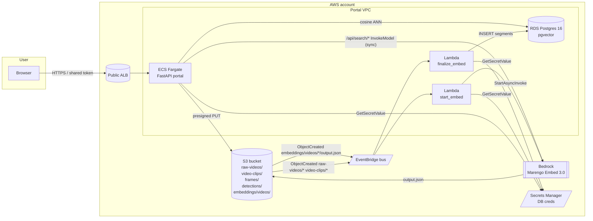

# Embedding & Search Roadmap

End-to-end design for video search on the Energy Infrastructure Health
Platform. We use **TwelveLabs Marengo Embed 3.0** on Amazon Bedrock for the
multimodal model, **Postgres + `pgvector`** (an RDS instance we already
provisioned) for the vector store, and the **existing FastAPI portal**
(ECS Fargate behind an ALB) for the UI. New uploads are embedded
asynchronously by **Lambdas + EventBridge** so the portal stays responsive.

This file is the canonical reference for the deploy plan, schema, IAM diff,
and the local-first iteration we follow before touching production.

---

## Phase summary

| Phase | Where it runs | What changes | Done when |
| --- | --- | --- | --- |
| **A** | laptop | `scripts/embed/` CLI: bulk-embed videos, sync query embeddings, in-memory cosine search, presigned URLs with `#t=<start>` | paste a result URL in a browser, video plays at the matched segment |
| **B** | laptop + docker | local `pgvector/pgvector:pg16` via `docker-compose`, migrations, `index_into_pg.py`, `search.py --backend pg` | top-K identical for `--backend mem` and `--backend pg` |
| **C** | laptop FastAPI | `app/search.py`, `/api/search/{text,image,text-image}`, "Search" tab in the portal HUD | search in the browser at `localhost:8000`, click result, video plays from `start_sec` |
| **D** | AWS | DB secret + Bedrock IAM on the ECS task; two Lambdas + EventBridge in `infra/embedding.tf`; bucket notifications on `raw-videos/`, `video-clips/`, `embeddings/videos/*/output.json` | drop a video into `raw-videos/` via the portal, the row appears in `video_segments`, search in the live UI returns it |

Phase A is intentionally cheap: no infra changes, no notebook, no Postgres.
Phase D is intentionally last: prod parity is the reward, not the
debugging environment.

---

## Architecture (target — end of Phase D)



Every arrow is one identity boundary the IAM policies must cover. See the
**IAM diff** section below for exactly what to add.

---

## Models and IDs

- **Foundation model id** (used by `start_async_invoke` for video):
  `twelvelabs.marengo-embed-3-0-v1:0`
- **Cross-region inference profile id** (used by `invoke_model` for sync
  text / image / text+image):
  - `us-east-1` → `us.twelvelabs.marengo-embed-3-0-v1:0`
  - `eu-west-1` → `eu.twelvelabs.marengo-embed-3-0-v1:0`
  - `ap-northeast-2` → `apac.twelvelabs.marengo-embed-3-0-v1:0`
- **Output dimensionality**: 512 (float32, L2-normalize before cosine).
- **Video segmentation**: Marengo returns one segment per ~6s clip with
  `startSec`, `endSec`, `embeddingOption`, `embeddingScope`, `embedding`.

---

## S3 layout

The portal already provisions four prefixes (`raw-videos/`, `video-clips/`,
`frames/`, `detections/`). Embeddings are stored next to them:

```
s3://video-upload-portal-<suffix>/
  raw-videos/<file>.mp4                       # uploaded by users
  video-clips/<file>.mp4
  frames/<file>.{jpg,png}
  detections/<file>.{json,jsonl}
  embeddings/videos/<job-uuid>/output.json    # written by Bedrock
```

`embeddings/videos/<job-uuid>/output.json` is what `start_async_invoke`'s
`s3OutputDataConfig` produces. The `<job-uuid>` keeps writes idempotent
across retries — we look the job up by `invocationArn` in the finalize
Lambda, not by S3 key.

---

## Postgres schema (Phase B onward)

`pgvector` is already enabled on the RDS instance (parameter group is
already tuned in `infra/rds.tf`). The schema lives in
`scripts/embed/migrations/` and is applied both locally (against
`docker-compose` Postgres) and in production (on ECS task boot when
`RUN_MIGRATIONS=1`).

```sql
-- 0001_init.sql
CREATE EXTENSION IF NOT EXISTS vector;

CREATE TABLE IF NOT EXISTS videos (
    s3_key            text        PRIMARY KEY,
    bucket            text        NOT NULL,
    duration_seconds  double precision,
    bytes             bigint,
    invocation_arn    text,
    embedded_at       timestamptz NOT NULL DEFAULT now(),
    model_id          text        NOT NULL,
    status            text        NOT NULL DEFAULT 'ready'
);

CREATE TABLE IF NOT EXISTS video_segments (
    id                bigserial   PRIMARY KEY,
    s3_key            text        NOT NULL REFERENCES videos(s3_key) ON DELETE CASCADE,
    segment_index     integer     NOT NULL,
    start_sec         double precision NOT NULL,
    end_sec           double precision NOT NULL,
    embedding_option  text        NOT NULL,                  -- 'visual' | 'audio'
    embedding_scope   text        NOT NULL DEFAULT 'clip',
    embedding         vector(512) NOT NULL,
    UNIQUE (s3_key, segment_index, embedding_option)
);

CREATE INDEX IF NOT EXISTS video_segments_embedding_hnsw
    ON video_segments
    USING hnsw (embedding vector_cosine_ops)
    WITH (m = 16, ef_construction = 64);

CREATE INDEX IF NOT EXISTS video_segments_s3_key_idx
    ON video_segments (s3_key);
```

Search query (Phase C/D, parameterized as `:q` is a 512-element vector
literal):

```sql
SELECT
    s.s3_key,
    s.segment_index,
    s.start_sec,
    s.end_sec,
    s.embedding_option,
    1 - (s.embedding <=> :q) AS score
FROM video_segments s
ORDER BY s.embedding <=> :q
LIMIT :k;
```

Notes:
- We persist L2-normalized vectors so `<=>` (cosine distance) and the
  in-memory `matrix @ q` agree to floating point.
- `(s3_key, segment_index, embedding_option)` is the natural upsert key.
- Frames and detection payloads are deliberately out of scope for v1; the
  schema leaves room for sibling tables (`frame_segments`, etc.) later.

---

## IAM diff (Phase D)

The portal already has:
- task **execution** role: ECR pull, CloudWatch Logs, `GetSecretValue` on
  the portal token + DB secret.
- task role: S3 (list/get/put on portal prefixes).

We need to **add** to the **task** role (so the FastAPI process can call
Bedrock for query embeddings and Secrets Manager for DB creds):

```hcl
# infra/main.tf — appended to the task role policy doc
statement {
  sid       = "BedrockInvokeForSearch"
  actions   = ["bedrock:InvokeModel"]
  resources = [
    "arn:aws:bedrock:${var.aws_region}::foundation-model/twelvelabs.marengo-embed-3-0-v1:0",
    "arn:aws:bedrock:${var.aws_region}:${data.aws_caller_identity.current.account_id}:inference-profile/us.twelvelabs.marengo-embed-3-0-v1:0",
  ]
}

statement {
  sid       = "ReadDbSecret"
  actions   = ["secretsmanager:GetSecretValue"]
  resources = [aws_secretsmanager_secret.db.arn]
}
```

And to the **two Lambdas** (`start_embed`, `finalize_embed`):

```hcl
# infra/embedding.tf
data "aws_iam_policy_document" "lambda_embed" {
  statement {
    sid       = "BedrockAsync"
    actions   = ["bedrock:StartAsyncInvoke", "bedrock:GetAsyncInvoke"]
    resources = [
      "arn:aws:bedrock:${var.aws_region}::foundation-model/twelvelabs.marengo-embed-3-0-v1:0",
    ]
  }

  statement {
    sid       = "S3RW"
    actions   = ["s3:GetObject", "s3:PutObject", "s3:ListBucket"]
    resources = [
      aws_s3_bucket.videos.arn,
      "${aws_s3_bucket.videos.arn}/*",
    ]
  }

  statement {
    sid       = "ReadDbSecret"
    actions   = ["secretsmanager:GetSecretValue"]
    resources = [aws_secretsmanager_secret.db.arn]
  }

  statement {
    sid     = "VpcEni"
    actions = [
      "ec2:CreateNetworkInterface",
      "ec2:DescribeNetworkInterfaces",
      "ec2:DeleteNetworkInterface",
      "ec2:AssignPrivateIpAddresses",
      "ec2:UnassignPrivateIpAddresses",
    ]
    resources = ["*"]
  }
}
```

Both Lambdas are VPC-attached (same subnets / SG as ECS) so they can reach
the RDS instance.

---

## EventBridge wiring (Phase D)

```hcl
# infra/embedding.tf (sketch)

resource "aws_s3_bucket_notification" "videos" {
  bucket      = aws_s3_bucket.videos.id
  eventbridge = true
}

resource "aws_cloudwatch_event_rule" "video_uploaded" {
  name = "${var.project_name}-video-uploaded"
  event_pattern = jsonencode({
    source      = ["aws.s3"]
    "detail-type" = ["Object Created"]
    detail = {
      bucket = { name = [aws_s3_bucket.videos.id] }
      object = { key = [
        { prefix = "raw-videos/" },
        { prefix = "video-clips/" },
      ] }
    }
  })
}

resource "aws_cloudwatch_event_rule" "embedding_ready" {
  name = "${var.project_name}-embedding-ready"
  event_pattern = jsonencode({
    source      = ["aws.s3"]
    "detail-type" = ["Object Created"]
    detail = {
      bucket = { name = [aws_s3_bucket.videos.id] }
      object = { key = [{ suffix = "/output.json" }] }
    }
  })
}
```

`start_embed` consumes `video_uploaded`, calls `StartAsyncInvoke`, and
upserts a row into `videos` with `status='embedding'` and `invocation_arn`.

`finalize_embed` consumes `embedding_ready`, downloads `output.json`,
upserts every segment into `video_segments`, and flips
`videos.status = 'ready'`.

We deliberately split into two Lambdas so the synchronous "kick it off"
hop stays under 5s (well under the soft EventBridge invocation budget) and
all the heavy lifting happens in the second hop, which can run for
minutes.

---

## ECS task changes (Phase D)

Add to the container definition in `infra/main.tf`:

```hcl
{
  name = "DATABASE_SECRET_ARN"
  value = aws_secretsmanager_secret.db.arn
},
{
  name = "RUN_MIGRATIONS"
  value = "1"
},
{
  name = "MARENGO_INFERENCE_ID"
  value = "us.twelvelabs.marengo-embed-3-0-v1:0"
},
```

The portal opens a `psycopg_pool.AsyncConnectionPool` on startup using
credentials read from the secret. Migrations under
`scripts/embed/migrations/` are bundled into the image and applied on
first boot when `RUN_MIGRATIONS=1`.

---

## Local-first runbook (today)

Repeat after every code change in Phase A:

```bash
# 1. credentials + bucket name
set -a; source ./.aws-demo.env; set +a
unset AWS_PROFILE
export AWS_CONFIG_FILE=/dev/null
export S3_BUCKET="$(terraform -chdir=infra output -raw bucket_name)"

# 2. embed everything new (cached on disk, idempotent)
pipenv run python -m scripts.embed.embed_videos

# 3. search
pipenv run python -m scripts.embed.search text "vegetation near a transmission line" -k 5
```

Smoke-test results from the first run (one video,
`raw-videos/pipeline_vegetation001.mp4`, 13 visual segments) confirmed the
top-K cluster around the visually-relevant segments and the presigned
`#t=<start_sec>` URLs jump straight to the matched moment in a browser.

---

## Open follow-ups (out of scope for v1)

- Embed `frames/` images and link them to nearby video segments by
  filename or timestamp.
- Embed JSON/JSONL detection payloads (concatenate label text → text
  embedding) so "find a thermal anomaly near a transformer" works without
  a frame.
- Pegasus (`twelvelabs.pegasus-1-2-v1:0`) for "describe this clip" /
  caption generation in the result modal.
- DLQ + retry for both Lambdas; today a `Failed`/`Expired` async job is
  silently logged.
- Auth on `/api/search/*` is inherited from the existing shared-token
  cookie middleware in `app/main.py` — no change needed but worth a test.
